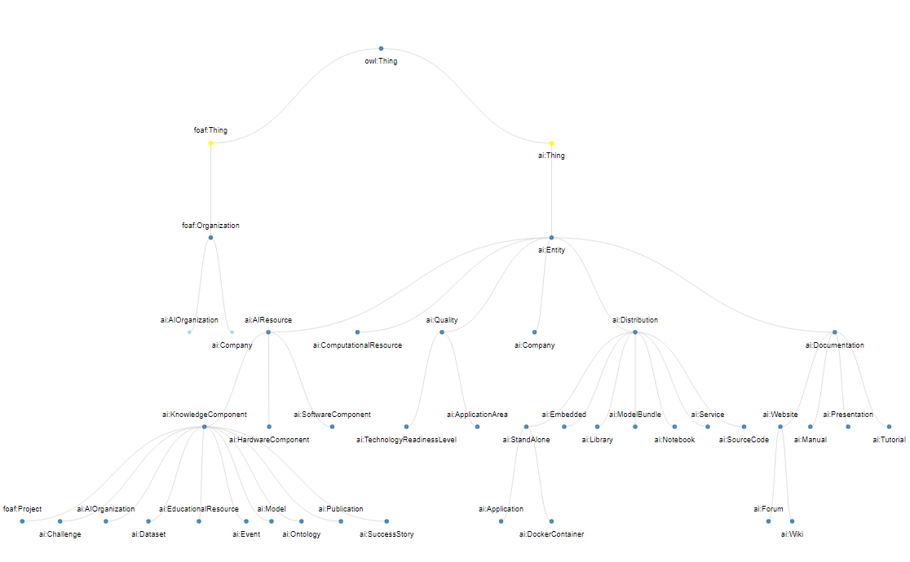
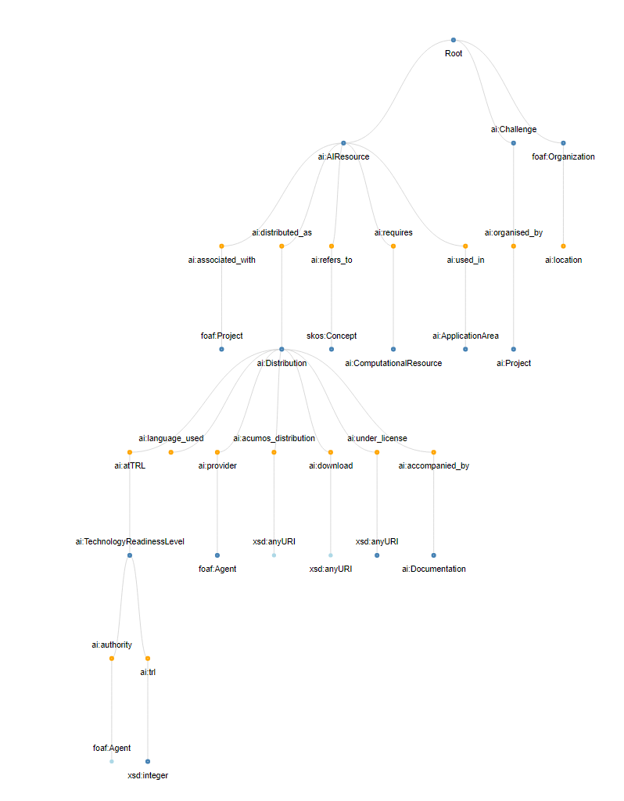

# AI4EU Conceptual Model

The AI4EU Conceptual Model aims to establish the conceptual foundation of the AI4EU platform. The rationale for creating the model relies on the observation that a conceptual framework, which allows the formalised description and association of AI resources, is essential for ensuring the stability, cohesiveness and expandability of the platform, also with respect to interoperability with other major AI-related EU H2020 platforms.

## Basic Model Principles

The central concept of the model is naturally the AI Resource. This can be specialized by various subclasses that conceptualise different types of technology e.g., Dataset, Software, Hardware, Ontology, etc. A single resource can potentially have more than one Distribution, depending on the packaging, licensing, access mechanisms, and other parameters. Additionally, each distribution is foreseen to be accompanied by its Documentation, which can also entail different objects with different characteristics (e.g., Wikis, Text Documents, Manuals, Code Tests and Examples, etc.). Such different types of documentation can also be modelled as specialisations of the generic Documentation class.
Furthermore, an AI Resource is associated with different descriptive entities that help characterise the resource, i.e., the topic(s) it refers to, relevant keywords, and the computational resources to which it mainly relies for functioning.
Another aspect of a resource is its usage on applications, services, products and challenges. These are modelled through the Application class that will entail the properties that describe it (name, URL and so on), and is also connected to an Application Area.

## Model Definition Using Semantic Web Technologies

The representation of the presented conceptual model in a machine-readable formalisation uses the Web Ontology Language (OWL) W3C Specification. In accordance with the reuse principles encouraged by the Semantic Web and Linked Data paradigms, the ontology imports and uses constructs from already defined and widely used ontologies and vocabularies. Specifically, the AI4EU ontology uses:
- Dublin Core Terms  for basic resource information (e.g., title, comment)
- FOAF for basic person and organisational information
- The Computer Science Ontology  for the taxonomy of computer science domains/topics to which a resource may pertain

In addition to the usage of the Computer Science Ontology for determining the scientific scope of a resource two controlled vocabularies were designed for formalizing references to Research Areas and Application Areas relevant to a resource. The vocabularies were described using the widely used Simple Knowledge Organization System (SKOS) W3C Recommendation.

## WP3 Ontology SPARQL Endpoint and Web Server

Contact: olivier.corby@inria.fr

We have set up a Web server and a SPARQL endpoint to query and browse the OWL ontology, the SKOS thesaurus (ai categories) and the Knowledge Graph (from Thales, thanks to E. Blaudez) :

http://corese.inria.fr/srv/service/ai4eu

There is a set of predefined SPARQL queries. Click on submit to execute a query.

For example, the query below enables us to select a type in the KG and obtain instances of this type :

http://corese.inria.fr/srv/service/ai4eu?uri=st:kg1

The URL in the result are browsable as hypertex links, hence we can browse the KG.

This query searches the skos thesaurus of ai categories :

http://corese.inria.fr/srv/service/ai4eu?uri=st:skos1

This one searches the ontology classes :

http://corese.inria.fr/srv/service/ai4eu?uri=st:owl1

This service displays the ontology class hierarchy :

http://corese.inria.fr/srv/service/class?param=%2Fdata%2Fdemo%2Fai4eu%2Fai4eu.ttl

This one displays the property signatures :

http://corese.inria.fr/srv/service/signature?param=%2Fdata%2Fdemo%2Fai4eu%2Fai4eu.ttl

There is a SPARQL endpoint at this URL :

http://corese.inria.fr/ai4eu/sparql

You can send a query via HTTP this way :

    wget "http://corese.inria.fr/ai4eu/sparql?query=prefix rel: <http://ai4eu.org/onto/> select * where {?s rel:instanceof ?o} limit 10" -O tmp.txt

or :

    curl -o tmp.txt --data-urlencode "query=select * where {?s ?p ?o} limit 10" http://corese.inria.fr/ai4eu/sparql
